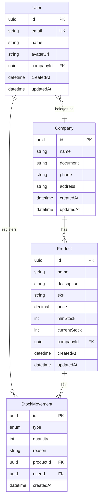
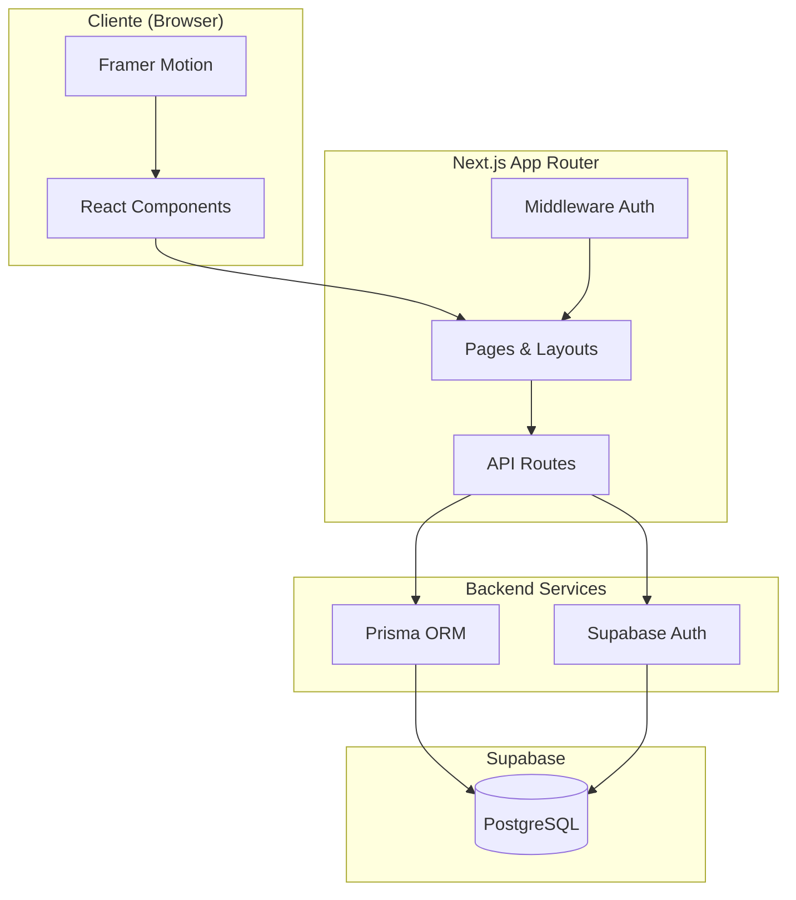

# Simple Inventory Manager - Visão Geral

## Descrição do Projeto

O **Simple Inventory Manager** é uma aplicação web moderna para gerenciamento de estoque, desenvolvida para pequenas e médias empresas. A plataforma permite controlar produtos, registrar movimentações de entrada e saída, e monitorar níveis de estoque com alertas automáticos.

## Funcionalidades Principais

- **Autenticação**: Login via Google OAuth ou email/senha
- **Onboarding**: Fluxo guiado para configuração inicial da empresa
- **Dashboard**: Visão geral com métricas e gráficos
- **Gestão de Produtos**: CRUD completo com SKU, preço e estoque mínimo
- **Movimentações**: Registro de entradas e saídas com histórico
- **Alertas**: Notificações visuais para estoque baixo
- **Multi-tenant**: Isolamento de dados por empresa

## Stack Tecnológica

| Categoria | Tecnologia | Versão |
|-----------|------------|--------|
| Framework | Next.js | 16.1.3 |
| UI Library | React | 19.2.3 |
| Linguagem | TypeScript | 5.x |
| Estilização | Tailwind CSS | v4 |
| Animações | Framer Motion | 11.x |
| ORM | Prisma | 6.x |
| Banco de Dados | PostgreSQL (Supabase) | - |
| Autenticação | Supabase Auth | - |

## Diagrama ER



## Arquitetura Geral



## Estrutura de Pastas

```
inventory-manager/
├── src/
│   ├── app/                    # App Router (páginas e layouts)
│   │   ├── (auth)/             # Grupo de rotas de autenticação
│   │   ├── (dashboard)/        # Grupo de rotas autenticadas
│   │   ├── api/                # API Routes
│   │   ├── layout.tsx          # Layout raiz
│   │   └── page.tsx            # Landing page
│   ├── components/             # Componentes reutilizáveis
│   │   ├── ui/                 # Componentes base (Button, Input, etc.)
│   │   └── features/           # Componentes de features
│   ├── lib/                    # Utilitários e configurações
│   │   ├── prisma.ts           # Cliente Prisma
│   │   ├── supabase.ts         # Cliente Supabase
│   │   └── utils.ts            # Funções auxiliares
│   ├── hooks/                  # Custom hooks
│   └── types/                  # Definições de tipos
├── prisma/
│   └── schema.prisma           # Schema do banco de dados
├── docs/                       # Documentação do projeto
└── public/                     # Arquivos estáticos
```

## Fases de Implementação

1. **Setup** - Configuração inicial do projeto e dependências
2. **Database** - Definição do schema e migrations
3. **Authentication** - Implementação de auth com Supabase
4. **Onboarding** - Fluxo de cadastro de usuário e empresa
5. **Dashboard** - Tela principal com métricas
6. **Products** - CRUD de produtos
7. **Stock Movements** - Registro de movimentações
8. **Alerts** - Sistema de alertas de estoque
9. **UI/UX** - Animações e polimento visual
