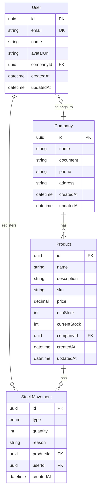

# Fase 2: Database Schema

## Diagrama ER



## Schema Prisma Completo

```prisma
// prisma/schema.prisma

generator client {
  provider = "prisma-client-js"
}

datasource db {
  provider  = "postgresql"
  url       = env("DATABASE_URL")
  directUrl = env("DIRECT_URL")
}

model User {
  id             String          @id @default(uuid())
  email          String          @unique
  name           String?
  avatarUrl      String?
  companyId      String?
  company        Company?        @relation(fields: [companyId], references: [id])
  stockMovements StockMovement[]
  createdAt      DateTime        @default(now())
  updatedAt      DateTime        @updatedAt

  @@index([companyId])
  @@index([email])
}

model Company {
  id        String    @id @default(uuid())
  name      String
  document  String?
  phone     String?
  address   String?
  users     User[]
  products  Product[]
  createdAt DateTime  @default(now())
  updatedAt DateTime  @updatedAt
}

model Product {
  id             String          @id @default(uuid())
  name           String
  description    String?
  sku            String?
  price          Decimal?        @db.Decimal(10, 2)
  minStock       Int             @default(0)
  currentStock   Int             @default(0)
  companyId      String
  company        Company         @relation(fields: [companyId], references: [id], onDelete: Cascade)
  stockMovements StockMovement[]
  createdAt      DateTime        @default(now())
  updatedAt      DateTime        @updatedAt

  @@index([companyId])
  @@index([sku])
}

model StockMovement {
  id        String       @id @default(uuid())
  type      MovementType
  quantity  Int
  reason    String?
  productId String
  product   Product      @relation(fields: [productId], references: [id], onDelete: Cascade)
  userId    String
  user      User         @relation(fields: [userId], references: [id])
  createdAt DateTime     @default(now())

  @@index([productId])
  @@index([userId])
  @@index([createdAt])
}

enum MovementType {
  IN
  OUT
}
```

## Relacionamentos

### User - Company (N:1)
- Um usuário pertence a uma empresa (opcional durante onboarding)
- Uma empresa pode ter vários usuários
- `companyId` é nullable para permitir criação do user antes do onboarding

### Company - Product (1:N)
- Uma empresa pode ter vários produtos
- Um produto pertence a uma única empresa
- Cascade delete: ao deletar empresa, produtos são removidos

### Product - StockMovement (1:N)
- Um produto pode ter várias movimentações
- Uma movimentação pertence a um único produto
- Cascade delete: ao deletar produto, movimentações são removidas

### User - StockMovement (1:N)
- Um usuário pode registrar várias movimentações
- Uma movimentação é registrada por um único usuário
- Mantém histórico de quem fez cada movimentação

## Comandos de Migration

### Criar Migration

```bash
npx prisma migrate dev --name init
```

### Aplicar em Produção

```bash
npx prisma migrate deploy
```

### Gerar Client

```bash
npx prisma generate
```

### Visualizar no Prisma Studio

```bash
npx prisma studio
```

## Validação com Zod

Schemas de validação correspondentes:

```typescript
// src/lib/validations/product.ts
import { z } from 'zod'

export const productSchema = z.object({
  name: z.string().min(1, 'Nome é obrigatório').max(100),
  description: z.string().max(500).optional(),
  sku: z.string().max(50).optional(),
  price: z.number().positive().optional(),
  minStock: z.number().int().min(0).default(0),
  currentStock: z.number().int().min(0).default(0),
})

export type ProductInput = z.infer<typeof productSchema>
```

```typescript
// src/lib/validations/movement.ts
import { z } from 'zod'

export const movementSchema = z.object({
  type: z.enum(['IN', 'OUT']),
  quantity: z.number().int().positive('Quantidade deve ser maior que 0'),
  reason: z.string().max(200).optional(),
  productId: z.string().uuid(),
})

export type MovementInput = z.infer<typeof movementSchema>
```

```typescript
// src/lib/validations/company.ts
import { z } from 'zod'

export const companySchema = z.object({
  name: z.string().min(1, 'Nome é obrigatório').max(100),
  document: z.string().max(20).optional(),
  phone: z.string().max(20).optional(),
  address: z.string().max(200).optional(),
})

export type CompanyInput = z.infer<typeof companySchema>
```

## Tipos TypeScript

```typescript
// src/types/index.ts
import type { User, Company, Product, StockMovement } from '@prisma/client'

export type { User, Company, Product, StockMovement }

export type ProductWithMovements = Product & {
  stockMovements: StockMovement[]
}

export type UserWithCompany = User & {
  company: Company | null
}

export type MovementWithDetails = StockMovement & {
  product: Product
  user: User
}
```

## Próximos Passos

Após criar o schema, prossiga para a [Fase 3: Authentication](./03-authentication.md).
