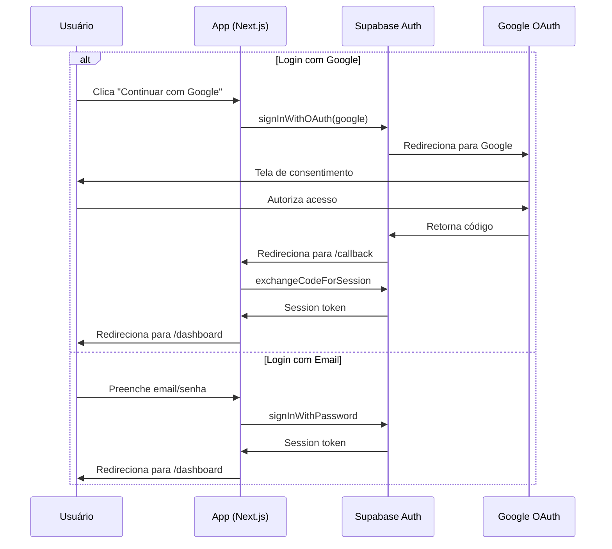

# Fase 3: Autenticação com Supabase

## Visão Geral

O sistema de autenticação utiliza Supabase Auth com duas opções:
- **OAuth com Google** - Login social
- **Email/Senha** - Cadastro tradicional

## Configuração do Supabase Auth

### 1. Dashboard Supabase

1. Acesse o projeto no [Supabase Dashboard](https://supabase.com/dashboard)
2. Vá em **Authentication > Providers**
3. Habilite **Email** provider
4. Habilite **Google** provider

### 2. Configurar Google OAuth

1. Acesse [Google Cloud Console](https://console.cloud.google.com)
2. Crie um projeto ou selecione existente
3. Vá em **APIs & Services > Credentials**
4. Crie **OAuth 2.0 Client ID**
5. Configure as URLs autorizadas:
   - Origem: `https://your-project.supabase.co`
   - Redirect: `https://your-project.supabase.co/auth/v1/callback`
6. Copie Client ID e Client Secret para o Supabase

## Middleware de Autenticação

```typescript
// src/middleware.ts
import { createServerClient } from '@supabase/ssr'
import { NextResponse, type NextRequest } from 'next/server'

export async function middleware(request: NextRequest) {
  let supabaseResponse = NextResponse.next({
    request,
  })

  const supabase = createServerClient(
    process.env.NEXT_PUBLIC_SUPABASE_URL!,
    process.env.NEXT_PUBLIC_SUPABASE_ANON_KEY!,
    {
      cookies: {
        getAll() {
          return request.cookies.getAll()
        },
        setAll(cookiesToSet) {
          cookiesToSet.forEach(({ name, value, options }) =>
            request.cookies.set(name, value)
          )
          supabaseResponse = NextResponse.next({
            request,
          })
          cookiesToSet.forEach(({ name, value, options }) =>
            supabaseResponse.cookies.set(name, value, options)
          )
        },
      },
    }
  )

  const {
    data: { user },
  } = await supabase.auth.getUser()

  // Rotas públicas
  const publicRoutes = ['/', '/login', '/signup', '/callback']
  const isPublicRoute = publicRoutes.some(route =>
    request.nextUrl.pathname === route ||
    request.nextUrl.pathname.startsWith('/callback')
  )

  // Redirecionar não autenticados
  if (!user && !isPublicRoute) {
    const url = request.nextUrl.clone()
    url.pathname = '/login'
    return NextResponse.redirect(url)
  }

  // Redirecionar autenticados da página de login
  if (user && (request.nextUrl.pathname === '/login' || request.nextUrl.pathname === '/signup')) {
    const url = request.nextUrl.clone()
    url.pathname = '/dashboard'
    return NextResponse.redirect(url)
  }

  return supabaseResponse
}

export const config = {
  matcher: [
    '/((?!_next/static|_next/image|favicon.ico|.*\\.(?:svg|png|jpg|jpeg|gif|webp)$).*)',
  ],
}
```

## Callback Handler

```typescript
// src/app/(auth)/callback/route.ts
import { createClient } from '@/lib/supabase/server'
import { NextResponse } from 'next/server'

export async function GET(request: Request) {
  const { searchParams, origin } = new URL(request.url)
  const code = searchParams.get('code')
  const next = searchParams.get('next') ?? '/dashboard'

  if (code) {
    const supabase = await createClient()
    const { error } = await supabase.auth.exchangeCodeForSession(code)

    if (!error) {
      const forwardedHost = request.headers.get('x-forwarded-host')
      const isLocalEnv = process.env.NODE_ENV === 'development'

      if (isLocalEnv) {
        return NextResponse.redirect(`${origin}${next}`)
      } else if (forwardedHost) {
        return NextResponse.redirect(`https://${forwardedHost}${next}`)
      } else {
        return NextResponse.redirect(`${origin}${next}`)
      }
    }
  }

  return NextResponse.redirect(`${origin}/login?error=auth`)
}
```

## Página de Login

```typescript
// src/app/(auth)/login/page.tsx
import { LoginForm } from '@/components/features/login-form'

export default function LoginPage() {
  return (
    <div className="min-h-screen flex items-center justify-center bg-gray-50">
      <div className="max-w-md w-full space-y-8 p-8">
        <div className="text-center">
          <h2 className="text-3xl font-bold">Entrar</h2>
          <p className="mt-2 text-gray-600">
            Acesse sua conta para gerenciar seu estoque
          </p>
        </div>
        <LoginForm />
      </div>
    </div>
  )
}
```

## Componente de Login

```typescript
// src/components/features/login-form.tsx
'use client'

import { useState } from 'react'
import { createClient } from '@/lib/supabase/client'
import { Button } from '@/components/ui/button'
import { Input } from '@/components/ui/input'

export function LoginForm() {
  const [email, setEmail] = useState('')
  const [password, setPassword] = useState('')
  const [loading, setLoading] = useState(false)
  const [error, setError] = useState<string | null>(null)

  const supabase = createClient()

  async function handleEmailLogin(e: React.FormEvent) {
    e.preventDefault()
    setLoading(true)
    setError(null)

    const { error } = await supabase.auth.signInWithPassword({
      email,
      password,
    })

    if (error) {
      setError(error.message)
      setLoading(false)
      return
    }

    window.location.href = '/dashboard'
  }

  async function handleGoogleLogin() {
    setLoading(true)

    const { error } = await supabase.auth.signInWithOAuth({
      provider: 'google',
      options: {
        redirectTo: `${window.location.origin}/callback`,
      },
    })

    if (error) {
      setError(error.message)
      setLoading(false)
    }
  }

  return (
    <div className="space-y-6">
      <Button
        onClick={handleGoogleLogin}
        disabled={loading}
        variant="outline"
        className="w-full"
      >
        <GoogleIcon className="w-5 h-5 mr-2" />
        Continuar com Google
      </Button>

      <div className="relative">
        <div className="absolute inset-0 flex items-center">
          <span className="w-full border-t" />
        </div>
        <div className="relative flex justify-center text-sm">
          <span className="bg-white px-2 text-gray-500">ou</span>
        </div>
      </div>

      <form onSubmit={handleEmailLogin} className="space-y-4">
        <Input
          type="email"
          placeholder="Email"
          value={email}
          onChange={(e) => setEmail(e.target.value)}
          required
        />
        <Input
          type="password"
          placeholder="Senha"
          value={password}
          onChange={(e) => setPassword(e.target.value)}
          required
        />

        {error && (
          <p className="text-sm text-red-600">{error}</p>
        )}

        <Button type="submit" disabled={loading} className="w-full">
          {loading ? 'Entrando...' : 'Entrar'}
        </Button>
      </form>

      <p className="text-center text-sm text-gray-600">
        Não tem conta?{' '}
        <a href="/signup" className="text-blue-600 hover:underline">
          Cadastre-se
        </a>
      </p>
    </div>
  )
}

function GoogleIcon({ className }: { className?: string }) {
  return (
    <svg className={className} viewBox="0 0 24 24">
      <path
        fill="currentColor"
        d="M22.56 12.25c0-.78-.07-1.53-.2-2.25H12v4.26h5.92c-.26 1.37-1.04 2.53-2.21 3.31v2.77h3.57c2.08-1.92 3.28-4.74 3.28-8.09z"
      />
      <path
        fill="currentColor"
        d="M12 23c2.97 0 5.46-.98 7.28-2.66l-3.57-2.77c-.98.66-2.23 1.06-3.71 1.06-2.86 0-5.29-1.93-6.16-4.53H2.18v2.84C3.99 20.53 7.7 23 12 23z"
      />
      <path
        fill="currentColor"
        d="M5.84 14.09c-.22-.66-.35-1.36-.35-2.09s.13-1.43.35-2.09V7.07H2.18C1.43 8.55 1 10.22 1 12s.43 3.45 1.18 4.93l2.85-2.22.81-.62z"
      />
      <path
        fill="currentColor"
        d="M12 5.38c1.62 0 3.06.56 4.21 1.64l3.15-3.15C17.45 2.09 14.97 1 12 1 7.7 1 3.99 3.47 2.18 7.07l3.66 2.84c.87-2.6 3.3-4.53 6.16-4.53z"
      />
    </svg>
  )
}
```

## Página de Signup

```typescript
// src/app/(auth)/signup/page.tsx
import { SignupForm } from '@/components/features/signup-form'

export default function SignupPage() {
  return (
    <div className="min-h-screen flex items-center justify-center bg-gray-50">
      <div className="max-w-md w-full space-y-8 p-8">
        <div className="text-center">
          <h2 className="text-3xl font-bold">Criar Conta</h2>
          <p className="mt-2 text-gray-600">
            Comece a gerenciar seu estoque gratuitamente
          </p>
        </div>
        <SignupForm />
      </div>
    </div>
  )
}
```

## Componente de Signup

```typescript
// src/components/features/signup-form.tsx
'use client'

import { useState } from 'react'
import { createClient } from '@/lib/supabase/client'
import { Button } from '@/components/ui/button'
import { Input } from '@/components/ui/input'

export function SignupForm() {
  const [email, setEmail] = useState('')
  const [password, setPassword] = useState('')
  const [name, setName] = useState('')
  const [loading, setLoading] = useState(false)
  const [error, setError] = useState<string | null>(null)
  const [success, setSuccess] = useState(false)

  const supabase = createClient()

  async function handleSignup(e: React.FormEvent) {
    e.preventDefault()
    setLoading(true)
    setError(null)

    const { error } = await supabase.auth.signUp({
      email,
      password,
      options: {
        data: {
          name,
        },
        emailRedirectTo: `${window.location.origin}/callback`,
      },
    })

    if (error) {
      setError(error.message)
      setLoading(false)
      return
    }

    setSuccess(true)
    setLoading(false)
  }

  if (success) {
    return (
      <div className="text-center p-6 bg-green-50 rounded-lg">
        <h3 className="text-lg font-semibold text-green-800">
          Verifique seu email
        </h3>
        <p className="mt-2 text-green-600">
          Enviamos um link de confirmação para {email}
        </p>
      </div>
    )
  }

  return (
    <form onSubmit={handleSignup} className="space-y-4">
      <Input
        type="text"
        placeholder="Nome"
        value={name}
        onChange={(e) => setName(e.target.value)}
        required
      />
      <Input
        type="email"
        placeholder="Email"
        value={email}
        onChange={(e) => setEmail(e.target.value)}
        required
      />
      <Input
        type="password"
        placeholder="Senha (mínimo 6 caracteres)"
        value={password}
        onChange={(e) => setPassword(e.target.value)}
        minLength={6}
        required
      />

      {error && (
        <p className="text-sm text-red-600">{error}</p>
      )}

      <Button type="submit" disabled={loading} className="w-full">
        {loading ? 'Criando conta...' : 'Criar conta'}
      </Button>

      <p className="text-center text-sm text-gray-600">
        Já tem conta?{' '}
        <a href="/login" className="text-blue-600 hover:underline">
          Entrar
        </a>
      </p>
    </form>
  )
}
```

## Hook de Usuário

```typescript
// src/hooks/use-user.ts
'use client'

import { useEffect, useState } from 'react'
import { createClient } from '@/lib/supabase/client'
import type { User } from '@supabase/supabase-js'

export function useUser() {
  const [user, setUser] = useState<User | null>(null)
  const [loading, setLoading] = useState(true)

  const supabase = createClient()

  useEffect(() => {
    const getUser = async () => {
      const { data: { user } } = await supabase.auth.getUser()
      setUser(user)
      setLoading(false)
    }

    getUser()

    const { data: { subscription } } = supabase.auth.onAuthStateChange(
      (_event, session) => {
        setUser(session?.user ?? null)
        setLoading(false)
      }
    )

    return () => subscription.unsubscribe()
  }, [])

  return { user, loading }
}
```

## Logout

```typescript
// src/components/features/logout-button.tsx
'use client'

import { createClient } from '@/lib/supabase/client'
import { Button } from '@/components/ui/button'

export function LogoutButton() {
  const supabase = createClient()

  async function handleLogout() {
    await supabase.auth.signOut()
    window.location.href = '/login'
  }

  return (
    <Button onClick={handleLogout} variant="ghost">
      Sair
    </Button>
  )
}
```

## Fluxo de Autenticação



## Próximos Passos

Após configurar autenticação, prossiga para a [Fase 4: Onboarding](./04-onboarding.md).
