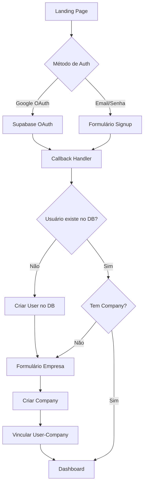
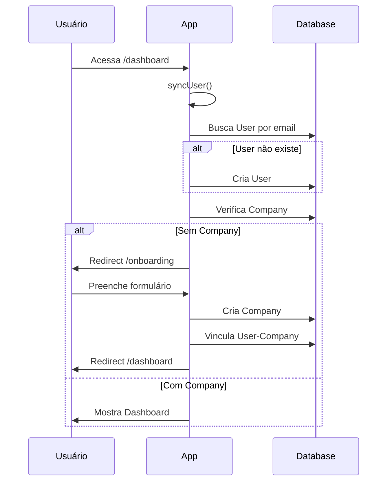

# Fase 4: Fluxo de Onboarding

## Diagrama de Fluxo



## Visão Geral

O onboarding garante que todo usuário autenticado tenha:
1. Um registro na tabela `User`
2. Uma empresa vinculada na tabela `Company`

## Sincronização de Usuário

Após autenticação, sincronizar dados do Supabase Auth com a tabela `User`:

```typescript
// src/lib/actions/sync-user.ts
'use server'

import { createClient } from '@/lib/supabase/server'
import { prisma } from '@/lib/prisma'

export async function syncUser() {
  const supabase = await createClient()
  const { data: { user: authUser } } = await supabase.auth.getUser()

  if (!authUser) {
    return { error: 'Not authenticated' }
  }

  // Buscar ou criar usuário no banco
  let user = await prisma.user.findUnique({
    where: { email: authUser.email! },
    include: { company: true },
  })

  if (!user) {
    user = await prisma.user.create({
      data: {
        id: authUser.id,
        email: authUser.email!,
        name: authUser.user_metadata?.name || authUser.user_metadata?.full_name,
        avatarUrl: authUser.user_metadata?.avatar_url,
      },
      include: { company: true },
    })
  }

  return { user }
}
```

## Layout do Dashboard

Verificar onboarding no layout:

```typescript
// src/app/(dashboard)/layout.tsx
import { redirect } from 'next/navigation'
import { syncUser } from '@/lib/actions/sync-user'
import { Sidebar } from '@/components/features/sidebar'

export default async function DashboardLayout({
  children,
}: {
  children: React.ReactNode
}) {
  const { user, error } = await syncUser()

  if (error || !user) {
    redirect('/login')
  }

  // Redirecionar para onboarding se não tiver empresa
  if (!user.company) {
    redirect('/onboarding')
  }

  return (
    <div className="flex min-h-screen">
      <Sidebar user={user} />
      <main className="flex-1 p-8">{children}</main>
    </div>
  )
}
```

## Página de Onboarding

```typescript
// src/app/(dashboard)/onboarding/page.tsx
import { redirect } from 'next/navigation'
import { syncUser } from '@/lib/actions/sync-user'
import { OnboardingForm } from '@/components/features/onboarding-form'

export default async function OnboardingPage() {
  const { user, error } = await syncUser()

  if (error || !user) {
    redirect('/login')
  }

  // Se já tem empresa, ir para dashboard
  if (user.company) {
    redirect('/dashboard')
  }

  return (
    <div className="min-h-screen flex items-center justify-center bg-gray-50">
      <div className="max-w-lg w-full space-y-8 p-8">
        <div className="text-center">
          <h2 className="text-3xl font-bold">Bem-vindo, {user.name || 'usuário'}!</h2>
          <p className="mt-2 text-gray-600">
            Para começar, cadastre os dados da sua empresa
          </p>
        </div>
        <OnboardingForm userId={user.id} />
      </div>
    </div>
  )
}
```

## Formulário de Onboarding

```typescript
// src/components/features/onboarding-form.tsx
'use client'

import { useState } from 'react'
import { useRouter } from 'next/navigation'
import { createCompany } from '@/lib/actions/company'
import { Button } from '@/components/ui/button'
import { Input } from '@/components/ui/input'

interface OnboardingFormProps {
  userId: string
}

export function OnboardingForm({ userId }: OnboardingFormProps) {
  const router = useRouter()
  const [loading, setLoading] = useState(false)
  const [error, setError] = useState<string | null>(null)

  async function handleSubmit(e: React.FormEvent<HTMLFormElement>) {
    e.preventDefault()
    setLoading(true)
    setError(null)

    const formData = new FormData(e.currentTarget)

    const result = await createCompany({
      name: formData.get('name') as string,
      document: formData.get('document') as string,
      phone: formData.get('phone') as string,
      address: formData.get('address') as string,
      userId,
    })

    if (result.error) {
      setError(result.error)
      setLoading(false)
      return
    }

    router.push('/dashboard')
  }

  return (
    <form onSubmit={handleSubmit} className="space-y-6">
      <div className="space-y-4">
        <div>
          <label htmlFor="name" className="block text-sm font-medium mb-1">
            Nome da Empresa *
          </label>
          <Input
            id="name"
            name="name"
            placeholder="Minha Empresa Ltda"
            required
          />
        </div>

        <div>
          <label htmlFor="document" className="block text-sm font-medium mb-1">
            CNPJ
          </label>
          <Input
            id="document"
            name="document"
            placeholder="00.000.000/0000-00"
          />
        </div>

        <div>
          <label htmlFor="phone" className="block text-sm font-medium mb-1">
            Telefone
          </label>
          <Input
            id="phone"
            name="phone"
            placeholder="(00) 00000-0000"
          />
        </div>

        <div>
          <label htmlFor="address" className="block text-sm font-medium mb-1">
            Endereço
          </label>
          <Input
            id="address"
            name="address"
            placeholder="Rua, número, cidade - estado"
          />
        </div>
      </div>

      {error && (
        <p className="text-sm text-red-600">{error}</p>
      )}

      <Button type="submit" disabled={loading} className="w-full">
        {loading ? 'Criando...' : 'Criar empresa e continuar'}
      </Button>
    </form>
  )
}
```

## Server Action - Criar Empresa

```typescript
// src/lib/actions/company.ts
'use server'

import { prisma } from '@/lib/prisma'
import { companySchema } from '@/lib/validations/company'
import { revalidatePath } from 'next/cache'

interface CreateCompanyInput {
  name: string
  document?: string
  phone?: string
  address?: string
  userId: string
}

export async function createCompany(input: CreateCompanyInput) {
  try {
    // Validar dados
    const validated = companySchema.parse({
      name: input.name,
      document: input.document,
      phone: input.phone,
      address: input.address,
    })

    // Criar empresa e vincular usuário em uma transação
    const company = await prisma.$transaction(async (tx) => {
      const newCompany = await tx.company.create({
        data: validated,
      })

      await tx.user.update({
        where: { id: input.userId },
        data: { companyId: newCompany.id },
      })

      return newCompany
    })

    revalidatePath('/dashboard')
    return { company }
  } catch (error) {
    console.error('Error creating company:', error)
    return { error: 'Erro ao criar empresa. Tente novamente.' }
  }
}
```

## Componentes de UI

### Input

```typescript
// src/components/ui/input.tsx
import { forwardRef } from 'react'
import { cn } from '@/lib/utils'

export interface InputProps
  extends React.InputHTMLAttributes<HTMLInputElement> {}

const Input = forwardRef<HTMLInputElement, InputProps>(
  ({ className, type, ...props }, ref) => {
    return (
      <input
        type={type}
        className={cn(
          'flex h-10 w-full rounded-md border border-gray-300 bg-white px-3 py-2 text-sm',
          'placeholder:text-gray-400',
          'focus:outline-none focus:ring-2 focus:ring-blue-500 focus:border-transparent',
          'disabled:cursor-not-allowed disabled:opacity-50',
          className
        )}
        ref={ref}
        {...props}
      />
    )
  }
)
Input.displayName = 'Input'

export { Input }
```

### Button

```typescript
// src/components/ui/button.tsx
import { forwardRef } from 'react'
import { cn } from '@/lib/utils'

interface ButtonProps extends React.ButtonHTMLAttributes<HTMLButtonElement> {
  variant?: 'default' | 'outline' | 'ghost'
}

const Button = forwardRef<HTMLButtonElement, ButtonProps>(
  ({ className, variant = 'default', ...props }, ref) => {
    return (
      <button
        className={cn(
          'inline-flex items-center justify-center rounded-md text-sm font-medium',
          'transition-colors focus:outline-none focus:ring-2 focus:ring-blue-500',
          'disabled:pointer-events-none disabled:opacity-50',
          'h-10 px-4 py-2',
          {
            'bg-blue-600 text-white hover:bg-blue-700': variant === 'default',
            'border border-gray-300 bg-white hover:bg-gray-50': variant === 'outline',
            'hover:bg-gray-100': variant === 'ghost',
          },
          className
        )}
        ref={ref}
        {...props}
      />
    )
  }
)
Button.displayName = 'Button'

export { Button }
```

## Validações

Máscara e validação de CNPJ (opcional):

```typescript
// src/lib/utils/masks.ts
export function maskCNPJ(value: string): string {
  return value
    .replace(/\D/g, '')
    .replace(/^(\d{2})(\d)/, '$1.$2')
    .replace(/^(\d{2})\.(\d{3})(\d)/, '$1.$2.$3')
    .replace(/\.(\d{3})(\d)/, '.$1/$2')
    .replace(/(\d{4})(\d)/, '$1-$2')
    .slice(0, 18)
}

export function maskPhone(value: string): string {
  return value
    .replace(/\D/g, '')
    .replace(/^(\d{2})(\d)/, '($1) $2')
    .replace(/(\d{5})(\d)/, '$1-$2')
    .slice(0, 15)
}
```

## Fluxo Completo



## Próximos Passos

Após implementar onboarding, prossiga para a [Fase 5: Dashboard](./05-dashboard.md).
