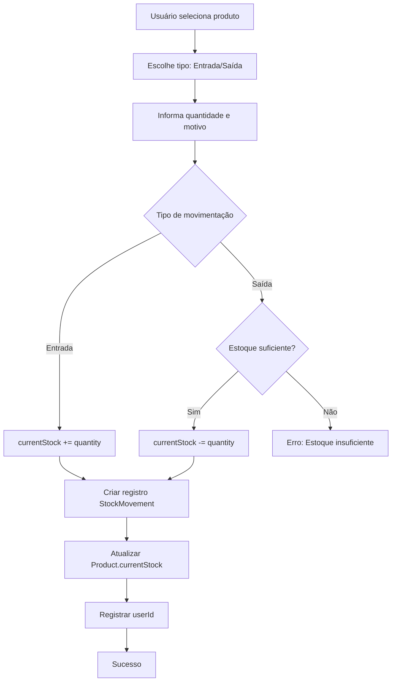

# Fase 7: Movimentações de Estoque

## Visão Geral

O módulo de movimentações permite:
- Registrar entradas de estoque
- Registrar saídas de estoque
- Visualizar histórico com filtros
- Atualização automática do estoque atual

## Fluxo de Movimentação



## Página de Movimentações

```typescript
// src/app/(dashboard)/movements/page.tsx
import { syncUser } from '@/lib/actions/sync-user'
import { getMovements } from '@/lib/actions/movements'
import { getProducts } from '@/lib/actions/products'
import { MovementsTable } from '@/components/features/movements-table'
import { NewMovementDialog } from '@/components/features/new-movement-dialog'

interface MovementsPageProps {
  searchParams: {
    type?: 'IN' | 'OUT'
    productId?: string
    startDate?: string
    endDate?: string
  }
}

export default async function MovementsPage({ searchParams }: MovementsPageProps) {
  const { user } = await syncUser()
  const [movements, products] = await Promise.all([
    getMovements(user!.companyId!, searchParams),
    getProducts(user!.companyId!),
  ])

  return (
    <div className="space-y-6">
      <div className="flex items-center justify-between">
        <div>
          <h1 className="text-3xl font-bold">Movimentações</h1>
          <p className="text-gray-600">Histórico de entradas e saídas</p>
        </div>
        <NewMovementDialog products={products} userId={user!.id} />
      </div>

      <MovementsTable
        movements={movements}
        products={products}
      />
    </div>
  )
}
```

## Server Actions

```typescript
// src/lib/actions/movements.ts
'use server'

import { prisma } from '@/lib/prisma'
import { movementSchema } from '@/lib/validations/movement'
import { revalidatePath } from 'next/cache'

interface GetMovementsParams {
  type?: 'IN' | 'OUT'
  productId?: string
  startDate?: string
  endDate?: string
}

export async function getMovements(companyId: string, params: GetMovementsParams = {}) {
  const { type, productId, startDate, endDate } = params

  return prisma.stockMovement.findMany({
    where: {
      product: { companyId },
      ...(type && { type }),
      ...(productId && { productId }),
      ...(startDate || endDate
        ? {
            createdAt: {
              ...(startDate && { gte: new Date(startDate) }),
              ...(endDate && { lte: new Date(endDate) }),
            },
          }
        : {}),
    },
    include: {
      product: { select: { name: true, sku: true } },
      user: { select: { name: true } },
    },
    orderBy: { createdAt: 'desc' },
  })
}

export async function createMovement(data: unknown, userId: string) {
  try {
    const validated = movementSchema.parse(data)

    // Buscar produto para validar estoque
    const product = await prisma.product.findUnique({
      where: { id: validated.productId },
    })

    if (!product) {
      return { error: 'Produto não encontrado' }
    }

    // Validar estoque para saídas
    if (validated.type === 'OUT' && product.currentStock < validated.quantity) {
      return {
        error: `Estoque insuficiente. Disponível: ${product.currentStock}`
      }
    }

    // Calcular novo estoque
    const newStock =
      validated.type === 'IN'
        ? product.currentStock + validated.quantity
        : product.currentStock - validated.quantity

    // Criar movimentação e atualizar estoque em transação
    const movement = await prisma.$transaction(async (tx) => {
      const newMovement = await tx.stockMovement.create({
        data: {
          type: validated.type,
          quantity: validated.quantity,
          reason: validated.reason,
          productId: validated.productId,
          userId,
        },
      })

      await tx.product.update({
        where: { id: validated.productId },
        data: { currentStock: newStock },
      })

      return newMovement
    })

    revalidatePath('/movements')
    revalidatePath('/dashboard')
    revalidatePath('/products')

    return { movement }
  } catch (error) {
    console.error('Error creating movement:', error)
    return { error: 'Erro ao registrar movimentação' }
  }
}
```

## Dialog de Nova Movimentação

```typescript
// src/components/features/new-movement-dialog.tsx
'use client'

import { useState } from 'react'
import { useRouter } from 'next/navigation'
import { createMovement } from '@/lib/actions/movements'
import { Button } from '@/components/ui/button'
import { Input } from '@/components/ui/input'
import { Plus, X } from 'lucide-react'
import type { Product } from '@/types'

interface NewMovementDialogProps {
  products: Product[]
  userId: string
}

export function NewMovementDialog({ products, userId }: NewMovementDialogProps) {
  const router = useRouter()
  const [open, setOpen] = useState(false)
  const [loading, setLoading] = useState(false)
  const [error, setError] = useState<string | null>(null)

  async function handleSubmit(e: React.FormEvent<HTMLFormElement>) {
    e.preventDefault()
    setLoading(true)
    setError(null)

    const formData = new FormData(e.currentTarget)
    const data = {
      type: formData.get('type') as 'IN' | 'OUT',
      quantity: Number(formData.get('quantity')),
      reason: formData.get('reason') as string,
      productId: formData.get('productId') as string,
    }

    const result = await createMovement(data, userId)

    if (result.error) {
      setError(result.error)
      setLoading(false)
      return
    }

    setOpen(false)
    setLoading(false)
    router.refresh()
  }

  if (!open) {
    return (
      <Button onClick={() => setOpen(true)}>
        <Plus className="w-4 h-4 mr-2" />
        Nova Movimentação
      </Button>
    )
  }

  return (
    <div className="fixed inset-0 z-50 flex items-center justify-center">
      <div
        className="absolute inset-0 bg-black/50"
        onClick={() => setOpen(false)}
      />
      <div className="relative bg-white rounded-lg p-6 w-full max-w-md shadow-xl">
        <div className="flex items-center justify-between mb-4">
          <h2 className="text-xl font-bold">Nova Movimentação</h2>
          <button onClick={() => setOpen(false)}>
            <X className="w-5 h-5" />
          </button>
        </div>

        <form onSubmit={handleSubmit} className="space-y-4">
          <div>
            <label className="block text-sm font-medium mb-1">Produto *</label>
            <select
              name="productId"
              required
              className="w-full h-10 px-3 border rounded-md"
            >
              <option value="">Selecione um produto</option>
              {products.map((product) => (
                <option key={product.id} value={product.id}>
                  {product.name} (Estoque: {product.currentStock})
                </option>
              ))}
            </select>
          </div>

          <div>
            <label className="block text-sm font-medium mb-1">Tipo *</label>
            <div className="flex gap-4">
              <label className="flex items-center gap-2">
                <input
                  type="radio"
                  name="type"
                  value="IN"
                  defaultChecked
                  className="w-4 h-4"
                />
                <span className="text-green-600 font-medium">Entrada</span>
              </label>
              <label className="flex items-center gap-2">
                <input
                  type="radio"
                  name="type"
                  value="OUT"
                  className="w-4 h-4"
                />
                <span className="text-red-600 font-medium">Saída</span>
              </label>
            </div>
          </div>

          <div>
            <label className="block text-sm font-medium mb-1">
              Quantidade *
            </label>
            <Input
              name="quantity"
              type="number"
              min="1"
              required
              placeholder="0"
            />
          </div>

          <div>
            <label className="block text-sm font-medium mb-1">Motivo</label>
            <Input
              name="reason"
              placeholder="Ex: Compra de fornecedor, Venda, Ajuste..."
            />
          </div>

          {error && <p className="text-sm text-red-600">{error}</p>}

          <div className="flex gap-3 pt-2">
            <Button type="submit" disabled={loading} className="flex-1">
              {loading ? 'Registrando...' : 'Registrar'}
            </Button>
            <Button
              type="button"
              variant="outline"
              onClick={() => setOpen(false)}
            >
              Cancelar
            </Button>
          </div>
        </form>
      </div>
    </div>
  )
}
```

## Tabela de Movimentações

```typescript
// src/components/features/movements-table.tsx
'use client'

import { useState } from 'react'
import { useRouter, useSearchParams } from 'next/navigation'
import { ArrowUp, ArrowDown, Filter } from 'lucide-react'
import { Button } from '@/components/ui/button'
import { Input } from '@/components/ui/input'
import type { Product } from '@/types'

interface Movement {
  id: string
  type: 'IN' | 'OUT'
  quantity: number
  reason: string | null
  createdAt: Date
  product: { name: string; sku: string | null }
  user: { name: string | null }
}

interface MovementsTableProps {
  movements: Movement[]
  products: Product[]
}

export function MovementsTable({ movements, products }: MovementsTableProps) {
  const router = useRouter()
  const searchParams = useSearchParams()
  const [showFilters, setShowFilters] = useState(false)

  function handleFilter(e: React.FormEvent<HTMLFormElement>) {
    e.preventDefault()
    const formData = new FormData(e.currentTarget)
    const params = new URLSearchParams()

    const type = formData.get('type') as string
    const productId = formData.get('productId') as string
    const startDate = formData.get('startDate') as string
    const endDate = formData.get('endDate') as string

    if (type) params.set('type', type)
    if (productId) params.set('productId', productId)
    if (startDate) params.set('startDate', startDate)
    if (endDate) params.set('endDate', endDate)

    router.push(`/movements?${params.toString()}`)
  }

  function clearFilters() {
    router.push('/movements')
  }

  return (
    <div className="space-y-4">
      <div className="flex items-center gap-2">
        <Button
          variant="outline"
          size="sm"
          onClick={() => setShowFilters(!showFilters)}
        >
          <Filter className="w-4 h-4 mr-2" />
          Filtros
        </Button>
        {searchParams.toString() && (
          <Button variant="ghost" size="sm" onClick={clearFilters}>
            Limpar filtros
          </Button>
        )}
      </div>

      {showFilters && (
        <form
          onSubmit={handleFilter}
          className="p-4 border rounded-lg bg-gray-50 space-y-4"
        >
          <div className="grid grid-cols-1 md:grid-cols-4 gap-4">
            <div>
              <label className="block text-sm font-medium mb-1">Tipo</label>
              <select
                name="type"
                defaultValue={searchParams.get('type') || ''}
                className="w-full h-10 px-3 border rounded-md bg-white"
              >
                <option value="">Todos</option>
                <option value="IN">Entrada</option>
                <option value="OUT">Saída</option>
              </select>
            </div>

            <div>
              <label className="block text-sm font-medium mb-1">Produto</label>
              <select
                name="productId"
                defaultValue={searchParams.get('productId') || ''}
                className="w-full h-10 px-3 border rounded-md bg-white"
              >
                <option value="">Todos</option>
                {products.map((p) => (
                  <option key={p.id} value={p.id}>
                    {p.name}
                  </option>
                ))}
              </select>
            </div>

            <div>
              <label className="block text-sm font-medium mb-1">
                Data Início
              </label>
              <Input
                name="startDate"
                type="date"
                defaultValue={searchParams.get('startDate') || ''}
              />
            </div>

            <div>
              <label className="block text-sm font-medium mb-1">Data Fim</label>
              <Input
                name="endDate"
                type="date"
                defaultValue={searchParams.get('endDate') || ''}
              />
            </div>
          </div>

          <Button type="submit" size="sm">
            Aplicar Filtros
          </Button>
        </form>
      )}

      <div className="border rounded-lg overflow-hidden">
        <table className="w-full">
          <thead className="bg-gray-50">
            <tr>
              <th className="px-4 py-3 text-left text-sm font-medium text-gray-600">
                Data
              </th>
              <th className="px-4 py-3 text-left text-sm font-medium text-gray-600">
                Tipo
              </th>
              <th className="px-4 py-3 text-left text-sm font-medium text-gray-600">
                Produto
              </th>
              <th className="px-4 py-3 text-right text-sm font-medium text-gray-600">
                Quantidade
              </th>
              <th className="px-4 py-3 text-left text-sm font-medium text-gray-600">
                Motivo
              </th>
              <th className="px-4 py-3 text-left text-sm font-medium text-gray-600">
                Usuário
              </th>
            </tr>
          </thead>
          <tbody className="divide-y">
            {movements.length === 0 ? (
              <tr>
                <td colSpan={6} className="px-4 py-8 text-center text-gray-500">
                  Nenhuma movimentação encontrada
                </td>
              </tr>
            ) : (
              movements.map((movement) => (
                <tr key={movement.id} className="hover:bg-gray-50">
                  <td className="px-4 py-3 text-sm">
                    {new Date(movement.createdAt).toLocaleString('pt-BR')}
                  </td>
                  <td className="px-4 py-3">
                    <div
                      className={`inline-flex items-center gap-1 px-2 py-1 rounded-full text-xs font-medium ${
                        movement.type === 'IN'
                          ? 'bg-green-100 text-green-700'
                          : 'bg-red-100 text-red-700'
                      }`}
                    >
                      {movement.type === 'IN' ? (
                        <ArrowUp className="w-3 h-3" />
                      ) : (
                        <ArrowDown className="w-3 h-3" />
                      )}
                      {movement.type === 'IN' ? 'Entrada' : 'Saída'}
                    </div>
                  </td>
                  <td className="px-4 py-3">
                    <p className="font-medium">{movement.product.name}</p>
                    {movement.product.sku && (
                      <p className="text-xs text-gray-500">
                        {movement.product.sku}
                      </p>
                    )}
                  </td>
                  <td className="px-4 py-3 text-right font-semibold">
                    <span
                      className={
                        movement.type === 'IN'
                          ? 'text-green-600'
                          : 'text-red-600'
                      }
                    >
                      {movement.type === 'IN' ? '+' : '-'}
                      {movement.quantity}
                    </span>
                  </td>
                  <td className="px-4 py-3 text-sm text-gray-600">
                    {movement.reason || '-'}
                  </td>
                  <td className="px-4 py-3 text-sm text-gray-600">
                    {movement.user.name || 'Usuário'}
                  </td>
                </tr>
              ))
            )}
          </tbody>
        </table>
      </div>
    </div>
  )
}
```

## Próximos Passos

Após implementar movimentações, prossiga para a [Fase 8: Alertas](./08-alerts.md).
