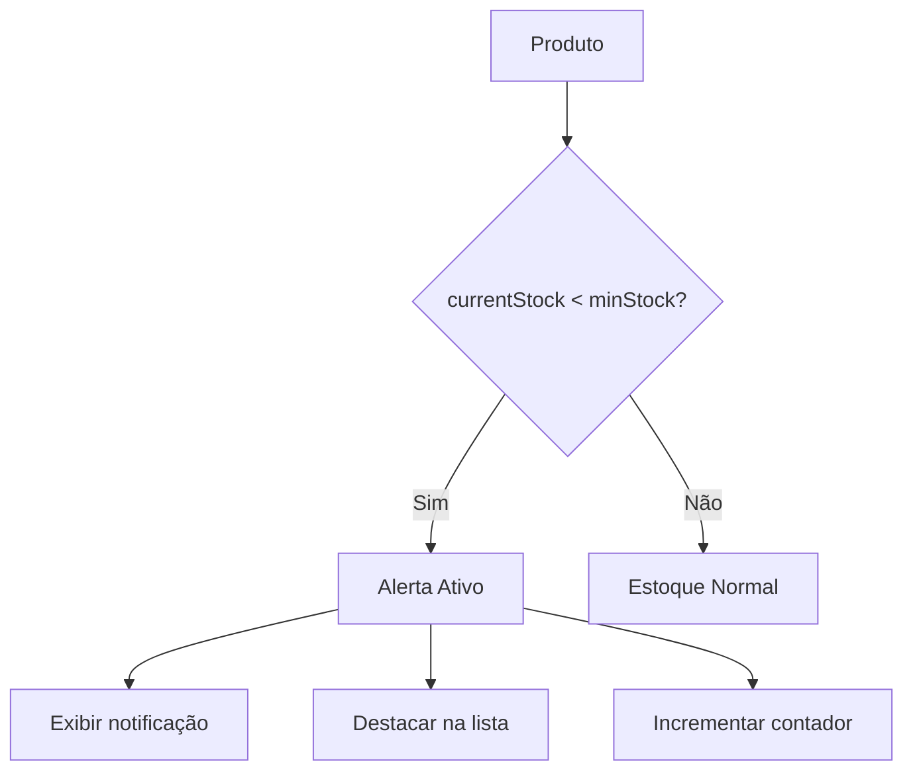

# Fase 8: Sistema de Alertas

## Visão Geral

O sistema de alertas monitora produtos com estoque abaixo do mínimo definido e notifica os usuários através de:
- Badge no menu de navegação
- Lista dedicada de alertas
- Destaque visual na listagem de produtos

## Lógica de Alertas



## Buscar Produtos com Estoque Baixo

```typescript
// src/lib/actions/alerts.ts
'use server'

import { prisma } from '@/lib/prisma'

export async function getLowStockProducts(companyId: string) {
  const products = await prisma.product.findMany({
    where: { companyId },
    select: {
      id: true,
      name: true,
      sku: true,
      currentStock: true,
      minStock: true,
    },
  })

  return products.filter((p) => p.currentStock < p.minStock)
}

export async function getLowStockCount(companyId: string) {
  const products = await prisma.product.findMany({
    where: { companyId },
    select: { currentStock: true, minStock: true },
  })

  return products.filter((p) => p.currentStock < p.minStock).length
}
```

## Página de Alertas

```typescript
// src/app/(dashboard)/alerts/page.tsx
import Link from 'next/link'
import { syncUser } from '@/lib/actions/sync-user'
import { getLowStockProducts } from '@/lib/actions/alerts'
import { Card } from '@/components/ui/card'
import { Button } from '@/components/ui/button'
import { AlertTriangle, ArrowRight, Package } from 'lucide-react'

export default async function AlertsPage() {
  const { user } = await syncUser()
  const products = await getLowStockProducts(user!.companyId!)

  return (
    <div className="space-y-6">
      <div>
        <h1 className="text-3xl font-bold">Alertas de Estoque</h1>
        <p className="text-gray-600">
          Produtos com estoque abaixo do mínimo configurado
        </p>
      </div>

      {products.length === 0 ? (
        <Card className="p-12 text-center">
          <div className="inline-flex items-center justify-center w-16 h-16 bg-green-100 rounded-full mb-4">
            <Package className="w-8 h-8 text-green-600" />
          </div>
          <h3 className="text-xl font-semibold mb-2">Tudo certo!</h3>
          <p className="text-gray-600">
            Todos os produtos estão com estoque adequado.
          </p>
        </Card>
      ) : (
        <div className="space-y-4">
          <div className="flex items-center gap-2 p-4 bg-amber-50 border border-amber-200 rounded-lg">
            <AlertTriangle className="w-5 h-5 text-amber-600" />
            <p className="text-amber-800">
              <strong>{products.length}</strong> produto(s) com estoque baixo
            </p>
          </div>

          <div className="grid gap-4">
            {products.map((product) => {
              const deficit = product.minStock - product.currentStock
              const percentage = Math.round(
                (product.currentStock / product.minStock) * 100
              )

              return (
                <Card key={product.id} className="p-6">
                  <div className="flex items-center justify-between">
                    <div className="flex items-center gap-4">
                      <div className="p-3 bg-red-100 rounded-lg">
                        <AlertTriangle className="w-6 h-6 text-red-600" />
                      </div>
                      <div>
                        <h3 className="font-semibold text-lg">{product.name}</h3>
                        {product.sku && (
                          <p className="text-sm text-gray-500">
                            SKU: {product.sku}
                          </p>
                        )}
                      </div>
                    </div>

                    <Link href={`/products/${product.id}`}>
                      <Button variant="outline" size="sm">
                        Ver produto
                        <ArrowRight className="w-4 h-4 ml-2" />
                      </Button>
                    </Link>
                  </div>

                  <div className="mt-4 grid grid-cols-3 gap-4">
                    <div>
                      <p className="text-sm text-gray-500">Estoque Atual</p>
                      <p className="text-2xl font-bold text-red-600">
                        {product.currentStock}
                      </p>
                    </div>
                    <div>
                      <p className="text-sm text-gray-500">Mínimo</p>
                      <p className="text-2xl font-bold">{product.minStock}</p>
                    </div>
                    <div>
                      <p className="text-sm text-gray-500">Faltam</p>
                      <p className="text-2xl font-bold text-amber-600">
                        {deficit}
                      </p>
                    </div>
                  </div>

                  <div className="mt-4">
                    <div className="flex justify-between text-sm mb-1">
                      <span>Nível do estoque</span>
                      <span>{percentage}%</span>
                    </div>
                    <div className="h-2 bg-gray-200 rounded-full overflow-hidden">
                      <div
                        className={`h-full rounded-full ${
                          percentage < 25
                            ? 'bg-red-500'
                            : percentage < 50
                            ? 'bg-amber-500'
                            : 'bg-yellow-500'
                        }`}
                        style={{ width: `${Math.min(percentage, 100)}%` }}
                      />
                    </div>
                  </div>
                </Card>
              )
            })}
          </div>
        </div>
      )}
    </div>
  )
}
```

## Badge de Notificação na Sidebar

Atualizar a sidebar para mostrar contador de alertas:

```typescript
// src/components/features/sidebar.tsx
import { getLowStockCount } from '@/lib/actions/alerts'

// Adicionar ao array de navegação
const navigation = [
  { name: 'Dashboard', href: '/dashboard', icon: LayoutDashboard },
  { name: 'Produtos', href: '/products', icon: Package },
  { name: 'Movimentações', href: '/movements', icon: ArrowLeftRight },
  { name: 'Alertas', href: '/alerts', icon: Bell, badge: true },
  { name: 'Configurações', href: '/settings', icon: Settings },
]

// No componente, buscar contagem
export async function Sidebar({ user }: SidebarProps) {
  const alertCount = await getLowStockCount(user.companyId!)

  return (
    <aside className="...">
      <nav className="space-y-1">
        {navigation.map((item) => {
          const isActive = pathname === item.href
          return (
            <Link
              key={item.name}
              href={item.href}
              className={cn(
                'flex items-center justify-between gap-3 px-3 py-2 rounded-lg',
                isActive ? 'bg-blue-600 text-white' : 'text-gray-300 hover:bg-gray-800'
              )}
            >
              <div className="flex items-center gap-3">
                <item.icon className="w-5 h-5" />
                {item.name}
              </div>
              {item.badge && alertCount > 0 && (
                <span className="px-2 py-0.5 text-xs font-medium bg-red-500 text-white rounded-full">
                  {alertCount}
                </span>
              )}
            </Link>
          )
        })}
      </nav>
    </aside>
  )
}
```

## Componente de Alerta Inline

Para usar em outras partes do sistema:

```typescript
// src/components/features/stock-alert-banner.tsx
import { AlertTriangle } from 'lucide-react'
import Link from 'next/link'

interface StockAlertBannerProps {
  count: number
}

export function StockAlertBanner({ count }: StockAlertBannerProps) {
  if (count === 0) return null

  return (
    <Link
      href="/alerts"
      className="flex items-center gap-3 p-4 bg-amber-50 border border-amber-200 rounded-lg hover:bg-amber-100 transition-colors"
    >
      <AlertTriangle className="w-5 h-5 text-amber-600 shrink-0" />
      <div className="flex-1">
        <p className="font-medium text-amber-800">
          {count} produto{count > 1 ? 's' : ''} com estoque baixo
        </p>
        <p className="text-sm text-amber-600">
          Clique para ver detalhes e tomar ação
        </p>
      </div>
    </Link>
  )
}
```

## Indicador Visual na Tabela de Produtos

Destacar produtos com estoque baixo na listagem:

```typescript
// Em products-table.tsx, adicionar indicador visual

<td className="px-4 py-3 text-right">
  <div className="flex items-center justify-end gap-2">
    {product.currentStock < product.minStock && (
      <AlertTriangle className="w-4 h-4 text-amber-500" />
    )}
    <span
      className={
        product.currentStock < product.minStock
          ? 'text-red-600 font-semibold'
          : ''
      }
    >
      {product.currentStock}
    </span>
  </div>
</td>
```

## Tooltip de Alerta

```typescript
// src/components/ui/tooltip.tsx
'use client'

import { useState } from 'react'
import { cn } from '@/lib/utils'

interface TooltipProps {
  content: string
  children: React.ReactNode
}

export function Tooltip({ content, children }: TooltipProps) {
  const [show, setShow] = useState(false)

  return (
    <div
      className="relative inline-block"
      onMouseEnter={() => setShow(true)}
      onMouseLeave={() => setShow(false)}
    >
      {children}
      <div
        className={cn(
          'absolute bottom-full left-1/2 -translate-x-1/2 mb-2 px-2 py-1',
          'bg-gray-900 text-white text-xs rounded whitespace-nowrap',
          'transition-opacity duration-200',
          show ? 'opacity-100' : 'opacity-0 pointer-events-none'
        )}
      >
        {content}
        <div className="absolute top-full left-1/2 -translate-x-1/2 border-4 border-transparent border-t-gray-900" />
      </div>
    </div>
  )
}
```

## Ação Rápida de Reposição

Botão para registrar entrada rapidamente:

```typescript
// src/components/features/quick-restock-button.tsx
'use client'

import { useState } from 'react'
import { useRouter } from 'next/navigation'
import { createMovement } from '@/lib/actions/movements'
import { Button } from '@/components/ui/button'
import { Input } from '@/components/ui/input'
import { Plus } from 'lucide-react'

interface QuickRestockButtonProps {
  productId: string
  productName: string
  userId: string
  suggestedQuantity: number
}

export function QuickRestockButton({
  productId,
  productName,
  userId,
  suggestedQuantity,
}: QuickRestockButtonProps) {
  const router = useRouter()
  const [open, setOpen] = useState(false)
  const [quantity, setQuantity] = useState(suggestedQuantity)
  const [loading, setLoading] = useState(false)

  async function handleRestock() {
    setLoading(true)

    await createMovement(
      {
        type: 'IN',
        quantity,
        reason: 'Reposição de estoque',
        productId,
      },
      userId
    )

    setLoading(false)
    setOpen(false)
    router.refresh()
  }

  if (!open) {
    return (
      <Button size="sm" onClick={() => setOpen(true)}>
        <Plus className="w-4 h-4 mr-1" />
        Repor
      </Button>
    )
  }

  return (
    <div className="flex items-center gap-2">
      <Input
        type="number"
        min="1"
        value={quantity}
        onChange={(e) => setQuantity(Number(e.target.value))}
        className="w-20 h-8"
      />
      <Button size="sm" onClick={handleRestock} disabled={loading}>
        {loading ? '...' : 'OK'}
      </Button>
      <Button size="sm" variant="ghost" onClick={() => setOpen(false)}>
        ✕
      </Button>
    </div>
  )
}
```

## Próximos Passos

Após implementar alertas, prossiga para a [Fase 9: Animações](./09-ui-animations.md).
